#Title
Text

##Hypercube
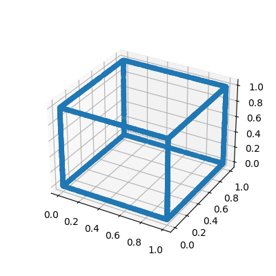
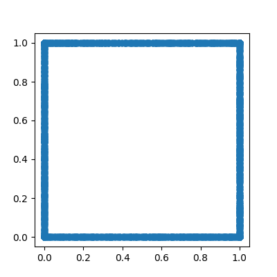

## Cross
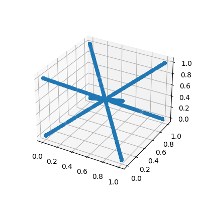
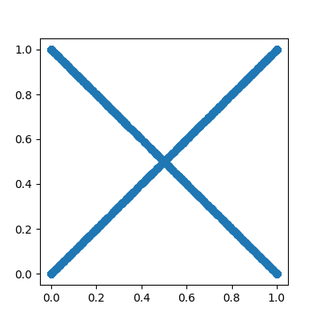

## Double Linear

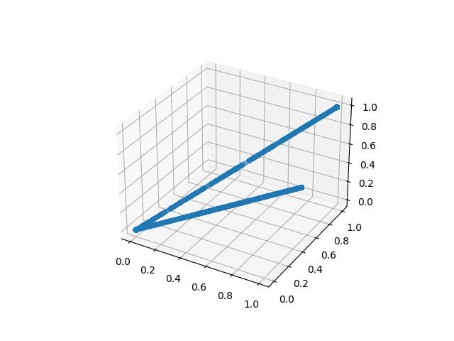
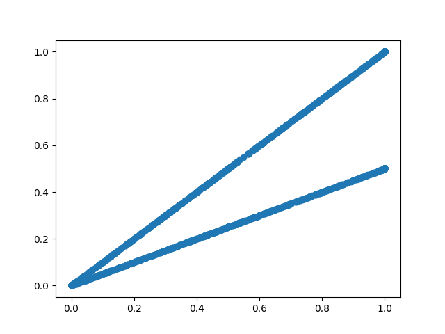

## Hourglass
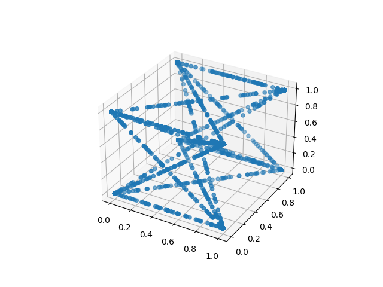
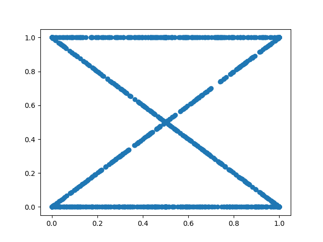

## Z
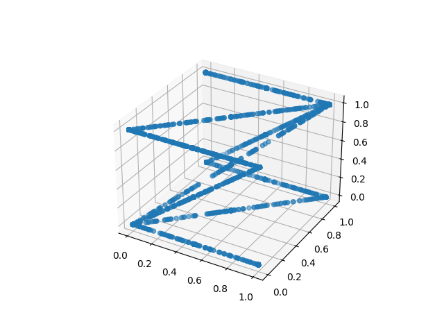

## Linear Periodic
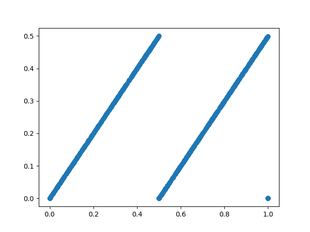

## Linear Step
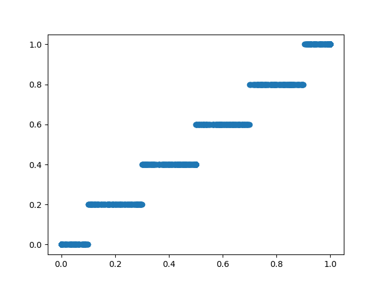

## Linear Then Dummy

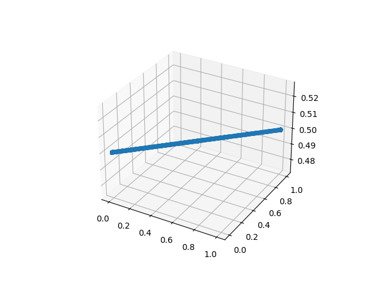
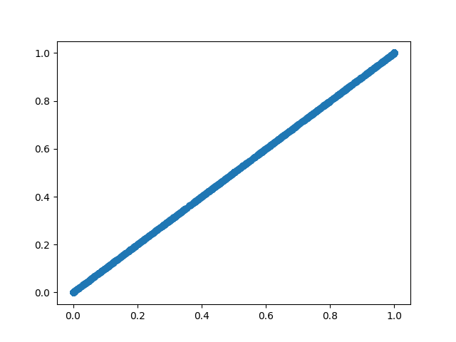

## Linear Then Noise

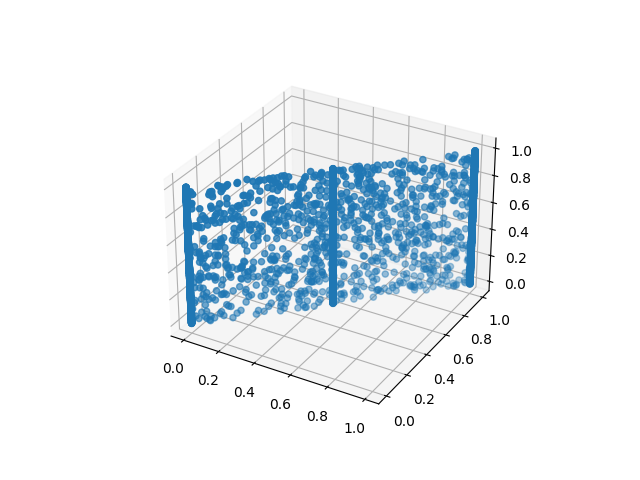

## Multi Gaussian
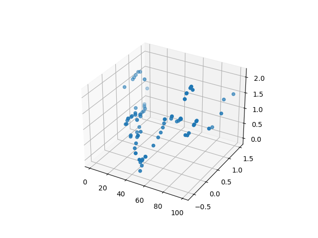
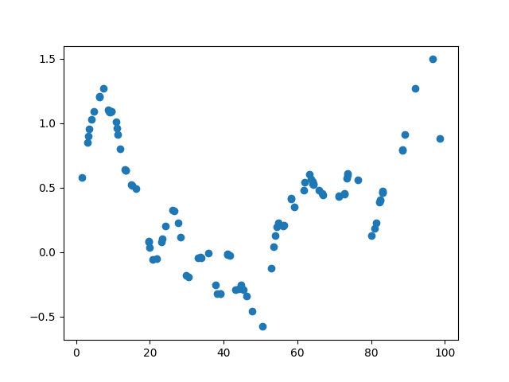

## Non Coexistence

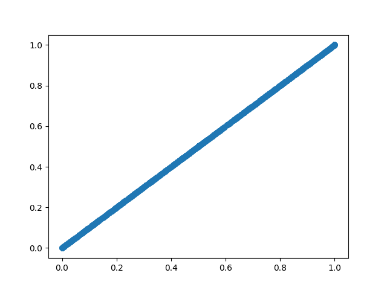

## Plus
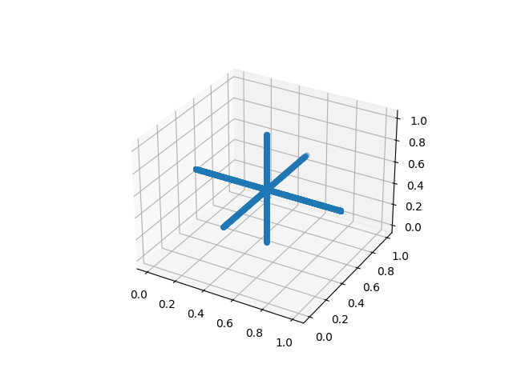
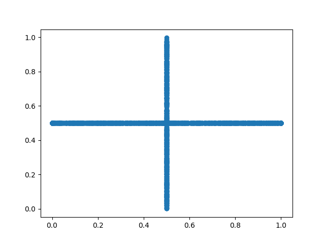

## Power
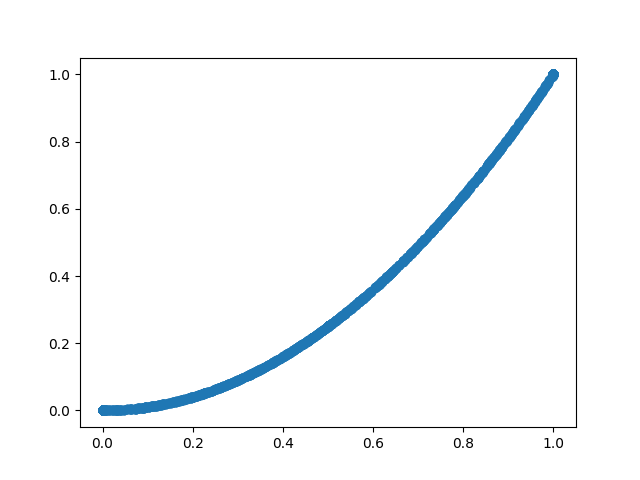
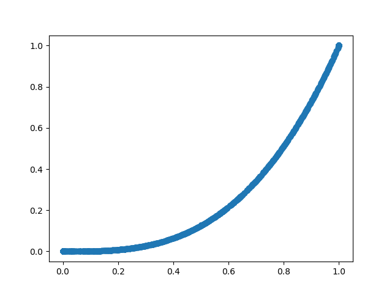
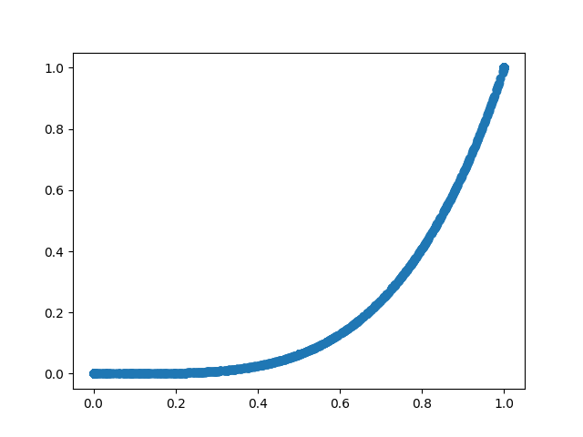

## Sine

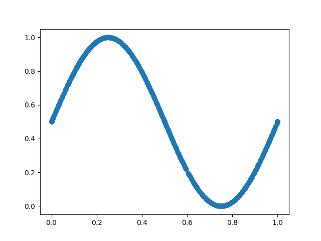

## Star
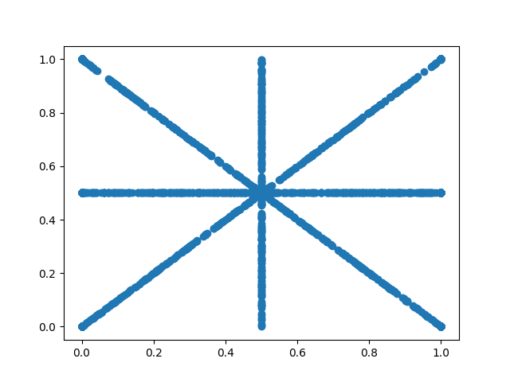
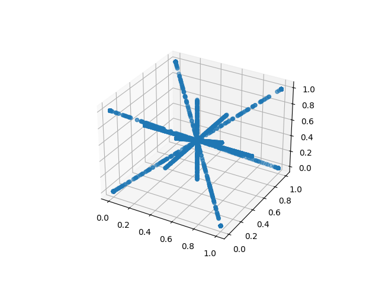

