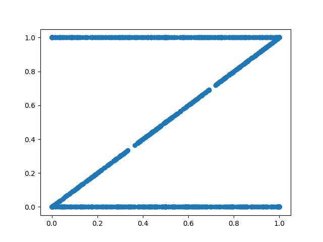

#Title
Text

##Hypercube

## Cross

## Double Linear

## Hourglass

## Z

## Linear Periodic

## Linear Step

## Linear Then Dummy

## Linear Then Noise

## Multi Gaussian

## Non Coexistence

## Plus

## Power

## Sine

## Star

